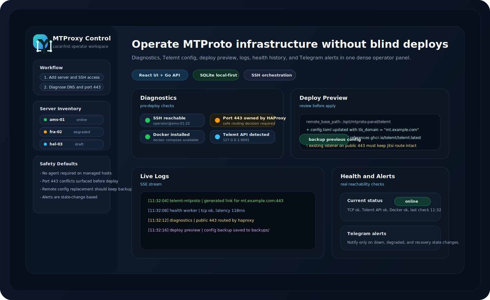

<p align="center">
  
</p>

<h1 align="center">MTProxy Control</h1>

<p align="center">
  Панель для управления Telegram MTProto proxy-серверами: SSH-диагностика, настройка Telemt, деплой, логи и мониторинг.
</p>

<p align="center">
  
</p>

## Что это

MTProxy Control - это локальная панель управления MTProto proxy-серверами. Проект состоит из Go API, React/Vite web UI и SQLite, а с серверами работает по SSH без отдельного агента.

## Быстрый локальный запуск

Нужно установить:

- `Go 1.22+`
- `Node.js` и `npm`
- `sqlite3`

Команды:

```bash
make setup
make db:migrate
make dev
```

После запуска:

- Web UI: `http://localhost:5173`
- API health: `http://localhost:8080/health`
- База данных: `./data/panel.db`

## Запуск через Docker Compose

```bash
docker compose build
docker compose up -d
```

После запуска:

- Web UI: `http://localhost:8081`
- API health: `http://localhost:8080/health`

Остановка:

```bash
docker compose down
```

Важно:

- `docker-compose.yml` монтирует `${HOME}/.ssh` в `/root/.ssh` только для чтения.
- Если в панели использовать `private_key_path`, внутри контейнера указывай путь вроде `/root/.ssh/id_ed25519`.

## Доступ через SSH туннель

Если панель поднята на удалённом сервере и ты не хочешь открывать сайт наружу, можно зайти через SSH-туннель.

На своём компьютере запусти:

```bash
ssh -N -L 8081:127.0.0.1:8081 -L 8080:127.0.0.1:8080 user@your-server
```

После этого открывай локально:

- Web UI: `http://127.0.0.1:8081`
- API health: `http://127.0.0.1:8080/health`

Если локальные порты заняты, можно взять другие:

```bash
ssh -N -L 18081:127.0.0.1:8081 -L 18080:127.0.0.1:8080 user@your-server
```

Тогда адреса будут такие:

- Web UI: `http://127.0.0.1:18081`
- API health: `http://127.0.0.1:18080/health`

## Полезные команды

```bash
make dev:api
make dev:web
make api:test
make web:test
make fmt
make lint
```
