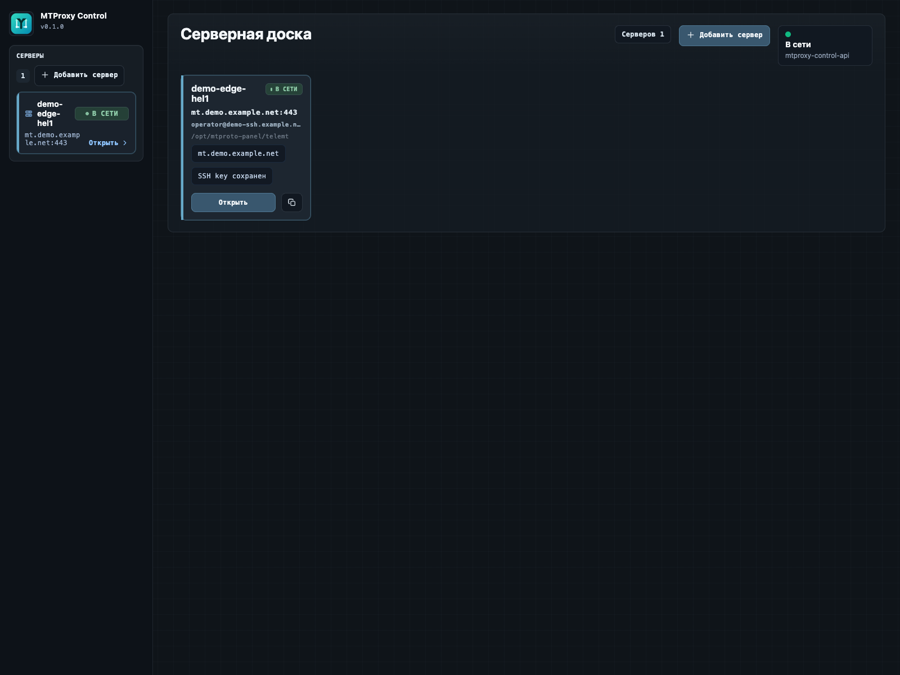
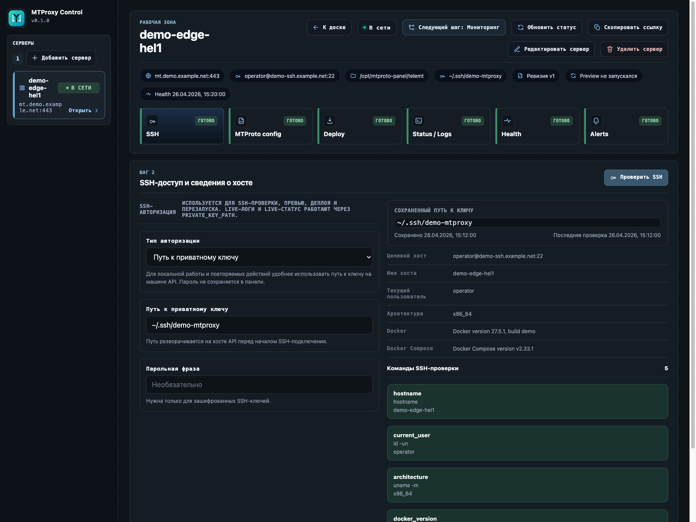
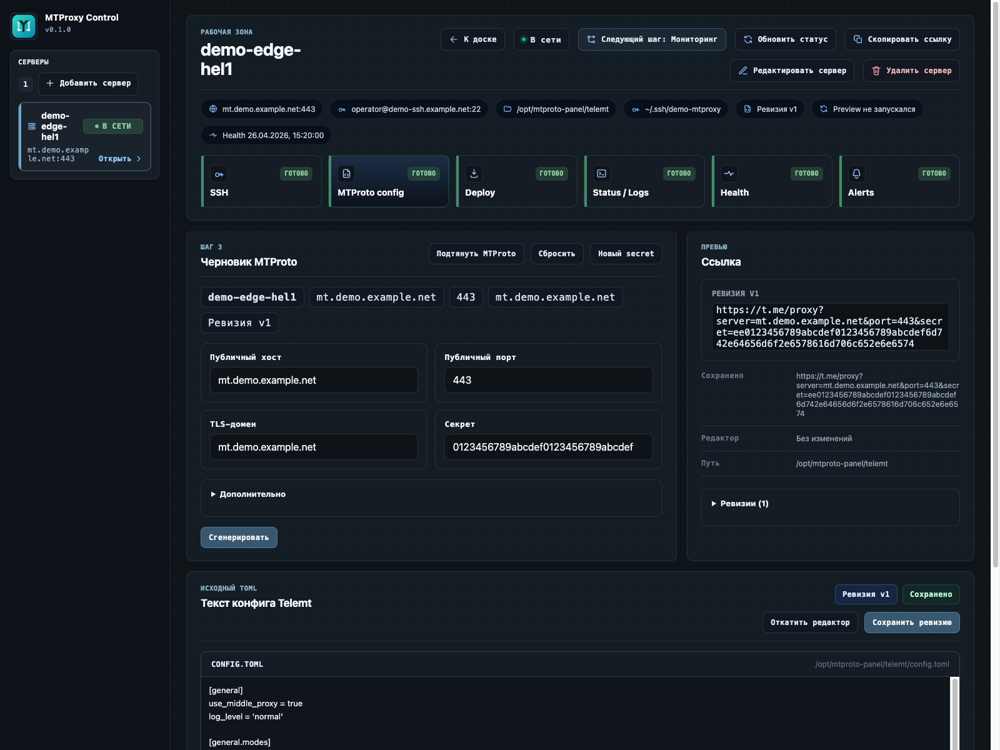

<p align="center">
  
</p>

<h1 align="center">MTProxy Control</h1>

<p align="center">
  Локальная панель для управления Telegram MTProto proxy-серверами.
</p>

<p align="center">
  
</p>

<p align="center">
  
</p>

<p align="center">
  
</p>

## О проекте

MTProxy Control - локальная панель для операторов Telegram MTProto proxy-серверов.

Панель подключается к серверам по SSH, помогает проверить состояние хоста, подготовить конфигурацию Telemt, выполнить deploy и просматривать состояние сервера в одном интерфейсе.

Для локального запуска используются Go API, React/Vite web UI и SQLite.

## Что потребуется

Перед запуском установите:

- `Go 1.22+`
- `Node.js` и `npm`
- `sqlite3`

## Локальный запуск

Выполните:

```bash
make setup
make db:migrate
make dev
```

После запуска будут доступны:

- Web UI: `http://localhost:5173`
- API health: `http://localhost:8080/health`
- База данных: `./data/panel.db`

## Локальный запуск через Docker Compose

Выполните:

```bash
docker compose build
docker compose up -d
```

После запуска будут доступны:

- Web UI: `http://localhost:8081`
- API health: `http://localhost:8080/health`

Для остановки выполните:

```bash
docker compose down
```

Обратите внимание:

- `docker-compose.yml` монтирует `${HOME}/.ssh` в `/root/.ssh` только для чтения.
- Если в панели используется `private_key_path`, внутри контейнера указывайте путь вида `/root/.ssh/id_ed25519`.

## Beta release в GitHub

В репозиторий добавлен workflow `.github/workflows/release.yml`.

При пуше тега вида `v0.1.0-beta.1` он:

- запускает `go test ./apps/api/...`
- запускает `npm test` и `npm run build` для `apps/web`
- собирает и публикует Docker-образы `mtproxy-control-api` и `mtproxy-control-web` в Docker Hub
- создаёт GitHub Release и помечает его как pre-release, если тег содержит `beta`
- прикладывает к релизу `deploy/docker-compose.release.yml` и `deploy/release.env.example`

Перед первым beta release настройте в GitHub репозитория:

- `Settings -> Secrets and variables -> Actions -> New repository secret`
- секрет `DOCKERHUB_USERNAME`
- секрет `DOCKERHUB_TOKEN`
- опционально repository variable `DOCKERHUB_NAMESPACE`, если образы нужно публиковать не в личный namespace, а в организацию

Команды для первого beta release:

```bash
make api:test
make web:test
git tag -a v0.1.0-beta.1 -m "Beta release v0.1.0-beta.1"
git push origin main
git push origin v0.1.0-beta.1
```

После этого GitHub Actions сам создаст pre-release и отправит образы в Docker Hub.

## Установка с Docker Hub

Готовый compose для установки из опубликованных образов лежит в `deploy/docker-compose.release.yml`, а шаблон окружения - в `deploy/release.env.example`.

Команды установки на сервере:

```bash
mkdir -p /opt/mtproxy-control
cd /opt/mtproxy-control
export RELEASE_TAG=v0.1.0-beta.1
curl -fsSL "https://raw.githubusercontent.com/Informativus/MTProtoControl/${RELEASE_TAG}/deploy/docker-compose.release.yml" -o docker-compose.yml
curl -fsSL "https://raw.githubusercontent.com/Informativus/MTProtoControl/${RELEASE_TAG}/deploy/release.env.example" -o .env
```

Потом откройте `.env`, замените значения под свой сервер и запустите:

```bash
docker compose --env-file .env pull
docker compose --env-file .env up -d
```

Для остановки:

```bash
docker compose --env-file .env down
```

## Как это работает

- контейнер `api` запускает миграции SQLite и поднимает Go API на `:8080`
- контейнер `api` остаётся во внутренней docker-сети и по умолчанию не публикуется наружу
- контейнер `web` отдаёт React UI через nginx на `:80`, проксирует `/api/*` в контейнер `api` и отдаёт `/health` наружу
- named volume `mtproxy-control-data` хранит SQLite базу между перезапусками
- каталог с SSH-ключами хоста монтируется в контейнер API только на чтение, чтобы панель могла подключаться к серверам по SSH

## Что менять в `.env`

- `API_IMAGE` и `WEB_IMAGE`: имя и тег образов в Docker Hub; обычно меняется только тег при обновлении релиза
- `WEB_PORT`: внешний порт web UI на сервере, по умолчанию `8081`
- `SSH_KEY_DIR`: путь на хосте до каталога с SSH-ключами; внутри контейнера он будет доступен как `/root/.ssh`
- `HEALTHCHECK_INTERVAL`: как часто панель делает автоматические health checks
- `APP_ENV`: оставляйте `production` для серверной установки
- `DATABASE_PATH`: обычно не меняйте, если хотите хранить SQLite в стандартном docker volume

Проверка health после установки будет доступна через `http://<host>:<WEB_PORT>/health`.

Если в панели будете указывать путь к приватному ключу, используйте путь внутри контейнера, например `/root/.ssh/id_ed25519`.

## Доступ через SSH туннель

Если панель запущена на удалённом сервере и вы не хотите открывать доступ к интерфейсу извне, используйте SSH-туннель.

На своём компьютере выполните:

```bash
ssh -N -L 8081:127.0.0.1:8081 -L 8080:127.0.0.1:8080 user@your-server
```

После этого откройте локально:

- Web UI: `http://127.0.0.1:8081`
- API health: `http://127.0.0.1:8080/health`

Если локальные порты заняты, используйте другие:

```bash
ssh -N -L 18081:127.0.0.1:8081 -L 18080:127.0.0.1:8080 user@your-server
```

Тогда будут доступны адреса:

- Web UI: `http://127.0.0.1:18081`
- API health: `http://127.0.0.1:18080/health`

## Полезные команды

```bash
make dev:api
make dev:web
make api:test
make web:test
make fmt
make lint
```
